## Reparación de vulnerabilidades IDOR – Modulo 1

### Cambio de Contraseña

El código original en el endpoint `/change-password` presentaba una vulnerabilidad crítica. Cuando un usuario enviaba una petición para cambiar su contraseña, el backend recibía un objeto JSON con un campo `id`. Este `id` era extraído directamente del cuerpo de la petición y utilizado para buscar al usuario en la base de datos. El código iteraba sobre todos los usuarios registrados hasta encontrar aquel cuyo `id` coincidiera con el proporcionado, y luego procedía a actualizar la contraseña de ese usuario.

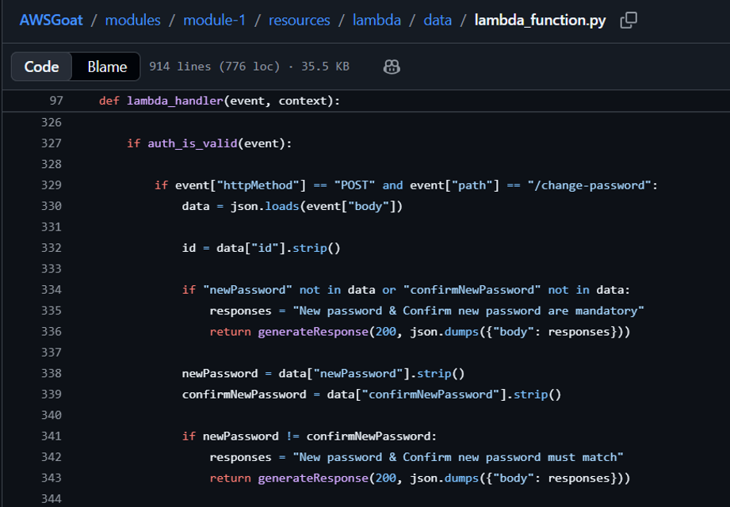

El problema radicaba en que el sistema confiaba ciegamente en el `id` que el cliente enviaba. Un atacante podía interceptar la petición de cambio de contraseña y modificar el valor del `id` en el cuerpo del mensaje, estableciéndolo al `id` de cualquier otro usuario del sistema. Al hacer esto, el backend, sin verificar que el `id` pertenecía efectivamente al usuario autenticado, cambiaba la contraseña de la víctima. Esto permitía a un atacante tomar control de cuentas ajenas, incluyendo administradores, simplemente conociendo su `id` numérico.

Para reparar esta vulnerabilidad, se modificó completamente la lógica del endpoint. En lugar de tomar el `id` del cuerpo de la petición, el código ahora obtiene el token JWT de la cabecera de autorización. Este token es decodificado y verificado utilizando la clave secreta almacenada en las variables de entorno. Del token decodificado se extraen el `email` y el `id` del usuario autenticado. Estos valores, provenientes del token firmado, son los únicos que se consideran válidos para la operación. De esta manera, la contraseña solo se actualiza para el usuario cuya identidad está verificada en el token, ignorando completamente cualquier `id` que el cliente haya podido incluir en el cuerpo de la petición.

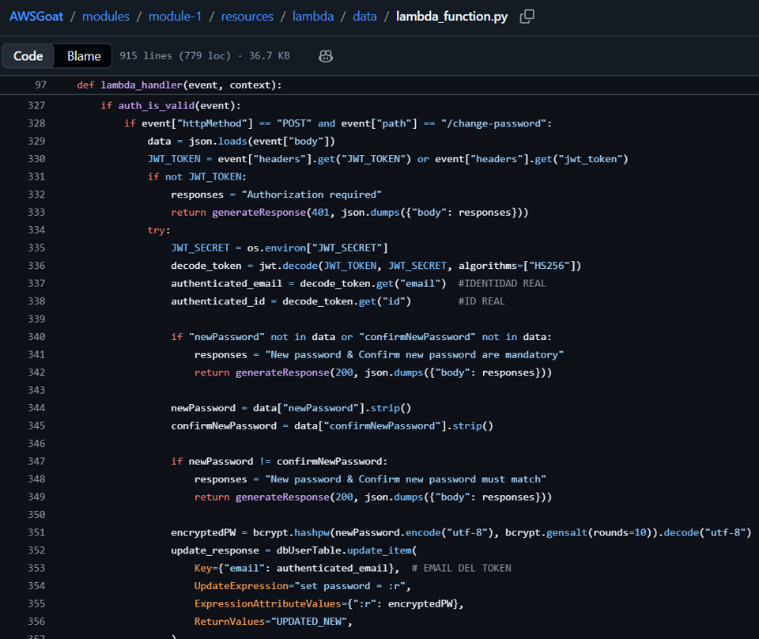

Con el código actualizado, si intentamos recrear la vulnerabilidad con los mismos pasos que anteriormente fue verificada, no funciona. Si en el usuario actual empezamos el proceso de cambio de contraseña.

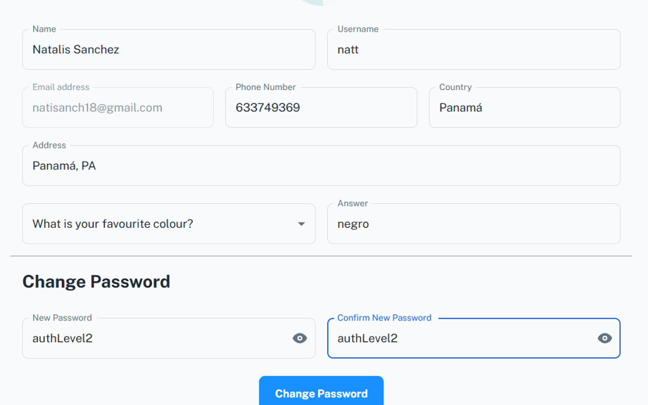

Y en Burp Suite interceptamos la petición y realizamos el cambio de ID por 1, que es el ID del usuario admin, recibimos el mismo mensaje de éxito al cambiar la contraseña.

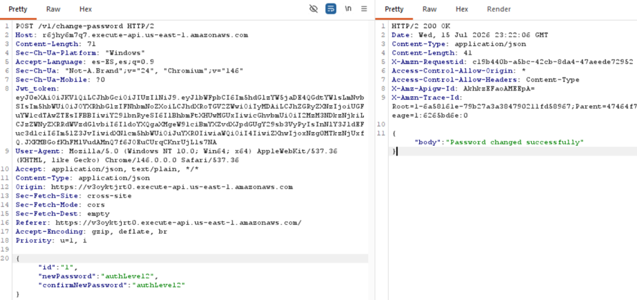

Pero al intentar ingresar con el email del usuario administrativo y con la nueva contraseña que le hemos asignado, veremos que es incorrecta. Es decir, la contraseña no cambió para el usuario con ID 1 como habíamos determinado.

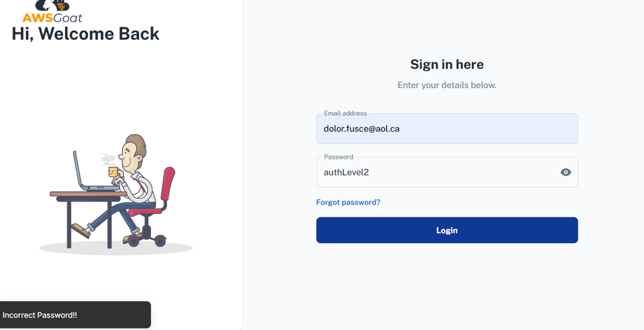

En cambio, si tratamos de ingresar con el email del usuario que cambió la contraseña e hizo el intento de alterar la del usuario admin, veremos que la contraseña ha cambiado para él.

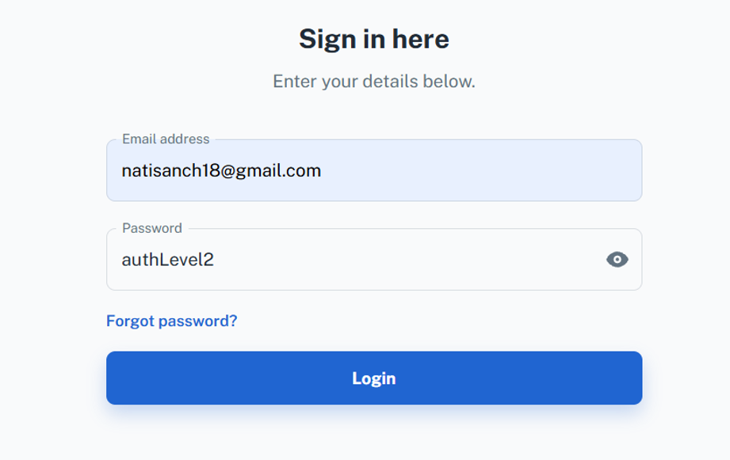

Cambiar la contraseña modificando el ID del usuario ya no funciona. Vulnerabilidad reparada.

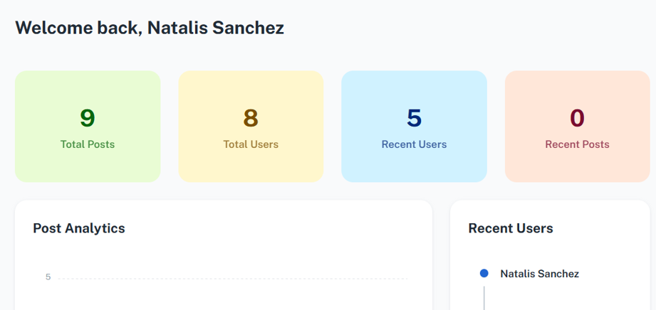

### Listado de Usuarios y Revelación de Información

El endpoint `/get-users` contenía otra vulnerabilidad de autorización. En su implementación original, el código recibía un nivel de autorización (`authLevel`) dentro del cuerpo de la petición. Este valor era utilizado para construir dinámicamente una consulta a la base de datos. Si el cliente enviaba `authLevel` con valor `"200"`, la consulta devolvía usuarios con niveles 200 y 100. Si enviaba `"100"`, la consulta devolvía usuarios con niveles 200, 100 y 0. Si enviaba cualquier otro valor, la consulta devolvía todos los usuarios.

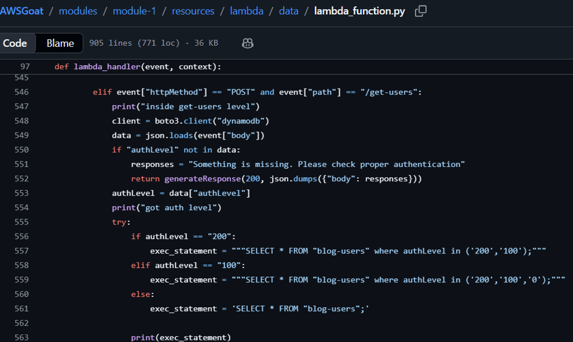

Un atacante podía manipular este parámetro `authLevel` para obtener información de usuarios de niveles superiores a los que su cuenta legítima le permitía ver. Por ejemplo, un usuario con nivel 200 (Autor) podía cambiar el valor a `"100"` y obtener la lista completa de usuarios, incluyendo administradores, junto con sus correos electrónicos y otros datos sensibles que normalmente estarían restringidos.

Para corregir esta vulnerabilidad, se implementó una lógica similar a la del cambio de contraseña. El código ahora obtiene el token JWT de la cabecera de autorización, lo decodifica y verifica, y extrae el `authLevel` real del usuario autenticado. Este valor extraído del token, que no puede ser manipulado por el cliente, es el que se utiliza para construir la consulta a la base de datos. Si el token indica que el usuario tiene `authLevel` `"200"`, la consulta devolverá usuarios con niveles 200 y 100. Si el token indica `"100"`, devolverá usuarios con niveles 200, 100 y 0. De esta manera, el nivel de acceso está determinado por el rol real del usuario autenticado, no por un parámetro que el cliente pueda modificar.

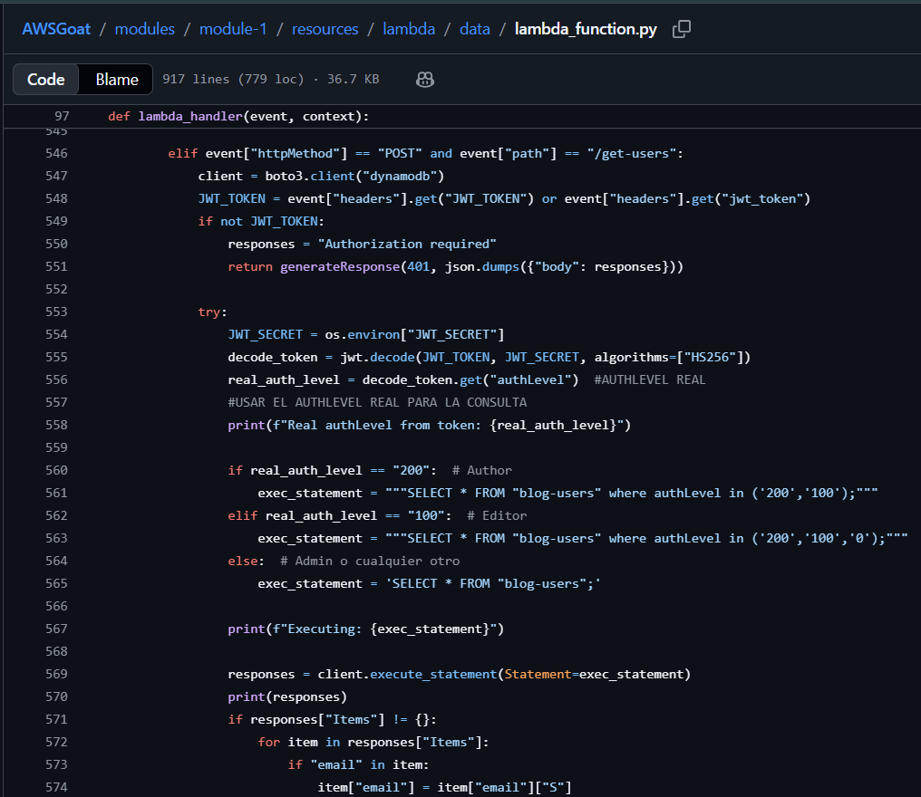

Antes, si modificábamos la petición a nivel 100, nos devolvía de último al usuario admin. Ahora no se puede cambiar a nivel 100 y no podemos ver los datos de usuarios nivel 0.

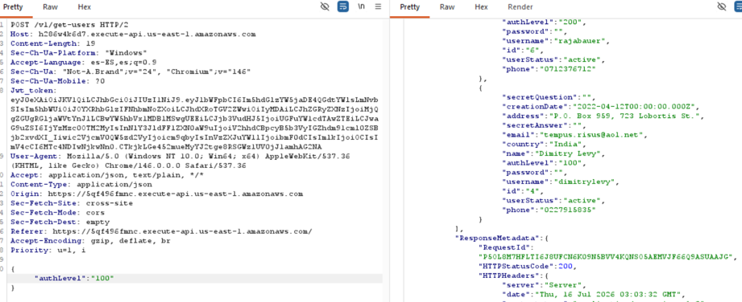

## Reparación de Vulnerabilidad SQLi en Login – Modulo 2

El archivo `login.php` presentaba una vulnerabilidad crítica de inyección SQL en el proceso de autenticación. El código original construía dinámicamente consultas SQL concatenando directamente los valores ingresados por el usuario en los campos de email y contraseña, sin realizar ningún tipo de validación o escape de caracteres especiales.

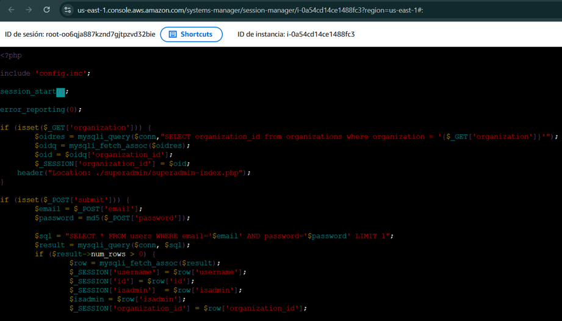

En el código vulnerable original, la variable `$email` se insertaba directamente en la cadena de la consulta SQL. Cuando un atacante ingresaba el payload `' or '1'='1'#` en el campo de email, la consulta resultante se transformaba en:

```sql
SELECT * FROM users
WHERE email='' or '1'='1'#'
AND password='md5_cualquiera'
LIMIT 1
```

El carácter `#` comentaba el resto de la consulta, incluyendo la verificación de la contraseña, mientras que la condición `'1'='1'` siempre se evaluaba como verdadera. Esto provocaba que la consulta devolviera todos los registros de la tabla de usuarios, permitiendo el acceso sin necesidad de credenciales válidas.

Para solucionarlo se implementaron sentencias preparadas (*prepared statements*) en ambos puntos vulnerables para separar completamente los datos de la lógica de la consulta SQL. Este enfoque garantiza que los valores ingresados por el usuario nunca sean interpretados como parte del comando SQL. El bloque de autenticación fue completamente reescrito utilizando el método `prepare()` de MySQLi. En esta implementación, los marcadores de posición `?` en la consulta indican dónde deben ir los datos. Luego, `bind_param` vincula los valores reales a estos marcadores, especificando que ambos son strings (`"ss"`). El motor de la base de datos trata estos valores únicamente como datos literales, no como código ejecutable.

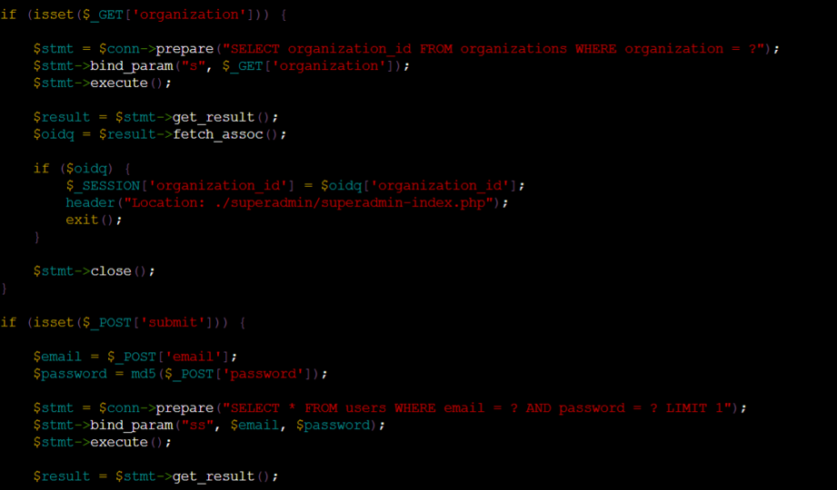

Se agregaron sentencias `exit()` después de cada redirección para prevenir que el script continúe ejecutándose después de enviar el encabezado de ubicación.

Se realizaron pruebas para confirmar que la vulnerabilidad ha sido completamente corregida. Los siguientes escenarios fueron probados:

```text
' or '1'='1'#
```

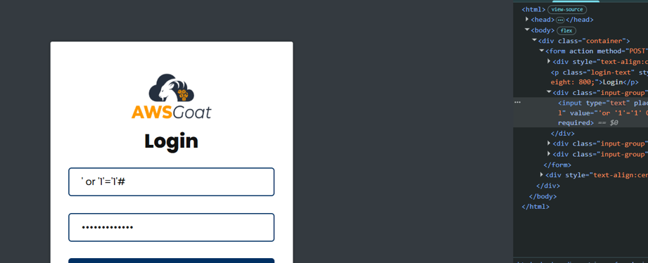

La aplicación muestra **"Email or Password is Wrong"**. No funciona.

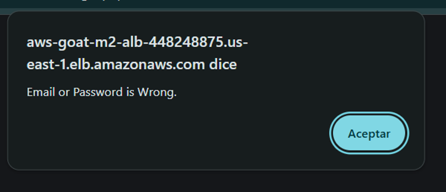

```text
'or '1'='1' ORDER BY id#
```

para intentar ingresar con el admin.

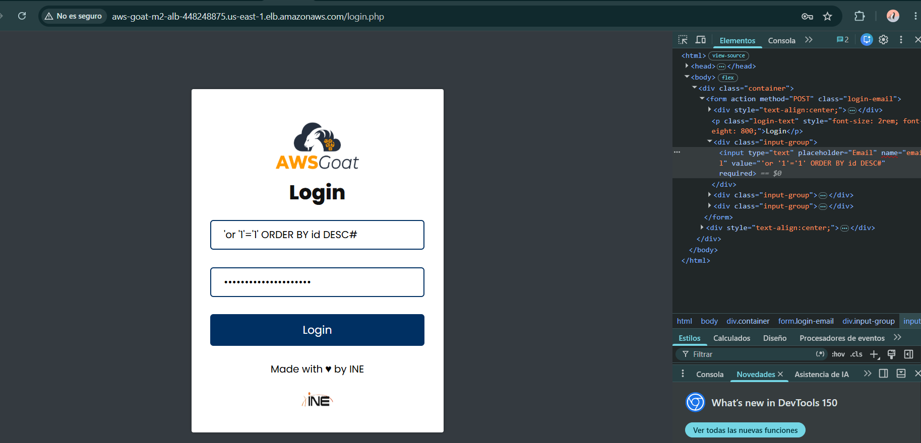

La aplicación muestra **"Email or Password is Wrong"**. Tampoco funciona.

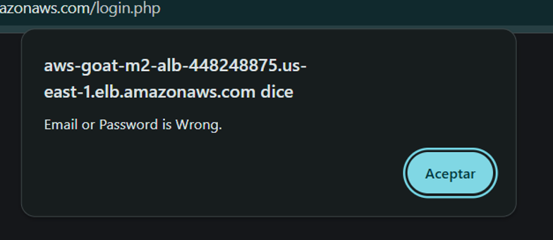
